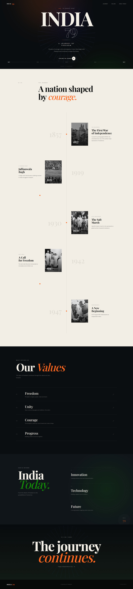

# 🇮🇳 India 79 --- A Journey of Freedom

A modern, responsive Independence Day website created to celebrate **79
years of India's independence** through a visual journey from **1857 to
1947**, while looking toward India's future.

The project combines historical storytelling, editorial typography, a
timeline-based layout, and a dark tricolour-inspired visual system using
**HTML5 and CSS3**.

------------------------------------------------------------------------

# 📸 Project Preview

### 🖥️ Desktop View



> Project output screenshot captured from the completed website.

------------------------------------------------------------------------

# ✨ Features

-   Independence Day themed landing page
-   "India 79" hero section
-   Animated Ashoka Chakra-inspired visual
-   Freedom timeline from 1857 to 1947
-   Historical event sections
-   1857 --- First War of Independence
-   1919 --- Jallianwala Bagh
-   1930 --- Salt March
-   1942 --- Quit India Movement
-   1947 --- Independence
-   Interactive timeline navigation
-   Our Values section
-   Freedom, Unity, Courage and Progress
-   India Today section
-   Innovation, Technology and Future highlights
-   Animated future-orbit visual
-   Final Independence Day message
-   Responsive desktop, tablet and mobile layouts
-   Reduced-motion support
-   Semantic HTML structure
-   Accessible navigation and image alt text
-   Smooth scrolling
-   CSS animations and transitions

------------------------------------------------------------------------

# 🛠️ Technologies Used

-   HTML5
-   CSS3
-   CSS Custom Properties
-   CSS Grid
-   CSS Flexbox
-   Responsive Media Queries
-   CSS Gradients
-   CSS Animations
-   CSS Transitions
-   `clamp()`
-   `aspect-ratio`
-   `backdrop-filter`
-   `prefers-reduced-motion`
-   Google Fonts --- DM Sans, Playfair Display

------------------------------------------------------------------------

# 🎨 Design Direction

The visual direction combines **editorial design with a modern Indian
Independence Day theme**.

  Token         Value
  ------------- -----------
  Saffron       `#FF671F`
  Green         `#138808`
  Chakra Blue   `#06038D`
  Dark          `#080B0D`
  Cream         `#F5F1E8`
  Muted         `#8F9290`

The design uses large editorial typography, warm cream surfaces, deep
charcoal sections, saffron and green accents, subtle Chakra-inspired
graphics, historical monochrome imagery, generous whitespace, and a
central timeline.

------------------------------------------------------------------------

# 🕰️ Freedom Timeline

  Year       Event
  ---------- -------------------------------
  **1857**   The First War of Independence
  **1919**   Jallianwala Bagh
  **1930**   The Salt March
  **1942**   Quit India Movement
  **1947**   Indian Independence

------------------------------------------------------------------------

# 📱 Responsive Design

### Desktop

-   Large editorial typography
-   Two-sided historical timeline
-   Multi-section layouts
-   Expanded navigation

### Tablet

-   Simplified navigation
-   Stacked timeline content
-   Responsive typography
-   Single-column sections where required

### Mobile

-   Mobile navigation button
-   Single-column content
-   Stacked historical cards
-   Compact spacing
-   Responsive timeline
-   Mobile-friendly footer

------------------------------------------------------------------------

# 📁 Project Structure

``` text
india-79/
│
├── index.html
├── style.css
├── README.md
│
├── images/
│   ├── india-1857.jpg
│   ├── india-1919.jpg
│   ├── india-1930.jpg
│   ├── india-1942.jpg
│   └── india-1947.jpg
│
└── screenshots/
    └── india-79-preview.jpg
```

------------------------------------------------------------------------

# 🚀 Installation

### 1. Clone the Repository

``` bash
git clone https://github.com/codingwithvignesh/india-79.git
```

### 2. Open the Project Folder

``` bash
cd india-79
```

### 3. Run the Project

Open `index.html` in your browser.

No build tools or additional installation are required.

For development, you can also use the **Live Server** extension in VS
Code.

------------------------------------------------------------------------

# 🌐 Live Demo

### Portfolio Website

https://vigneshux.netlify.app

### GitHub Profile

https://github.com/codingwithvignesh

### Project Repository

https://github.com/codingwithvignesh/india-79

------------------------------------------------------------------------

# 📷 Screenshots

Add the project screenshot inside the `screenshots` folder:

``` text
screenshots/
└── india-79-preview.jpg
```

The screenshot will appear automatically in the **Project Preview**
section of this README when the repository is viewed on GitHub.

------------------------------------------------------------------------

# 🎯 Project Goal

The goal of this project was to practice building a complete responsive
website using **HTML5 and CSS3**, while creating a meaningful visual
experience around India's Independence Day.

The project focuses on:

-   Historical storytelling
-   Visual hierarchy
-   Timeline-based information
-   Editorial typography
-   Responsive layouts
-   CSS animations
-   Accessible HTML structure
-   Responsive navigation
-   Design consistency
-   Modern frontend presentation

This project is part of my **Frontend Development Practice Journey**.

------------------------------------------------------------------------

# 🧠 What I Practiced

Through this project, I practiced:

-   Planning a complete multi-section website
-   Structuring a large HTML document
-   Creating reusable CSS components
-   Building a visual timeline
-   Working with historical images
-   Creating responsive layouts
-   Using CSS Grid for complex layouts
-   Using Flexbox for alignment
-   Creating responsive breakpoints
-   Creating CSS animations
-   Creating hover interactions
-   Using CSS custom properties
-   Working with typography hierarchy
-   Improving spacing and visual rhythm
-   Supporting reduced-motion preferences
-   Creating a consistent visual design system

------------------------------------------------------------------------

# ⚠️ Image & Copyright Notice

This repository is a **frontend development and educational practice
project**.

Historical photographs and other third-party visual assets may remain
subject to their respective copyright, public-domain status, or
licensing terms.

Where required, retain the original source and license information for
each historical image used in the project.

The website layout, HTML structure, CSS styling, and original design
work are created as part of this learning project.

------------------------------------------------------------------------

# 👨‍💻 Author

**Vignesh**

UI/UX Designer • Front-End Developer

### 🌐 Portfolio

https://vigneshux.netlify.app

### 💻 GitHub

https://github.com/codingwithvignesh

------------------------------------------------------------------------

# 📄 License

The frontend source code in this project is available for educational
and portfolio purposes.

Third-party images and other assets are subject to their respective
copyright and licensing terms.

------------------------------------------------------------------------

⭐ This project is part of my frontend development practice journey.
